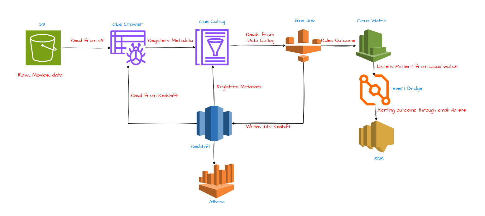
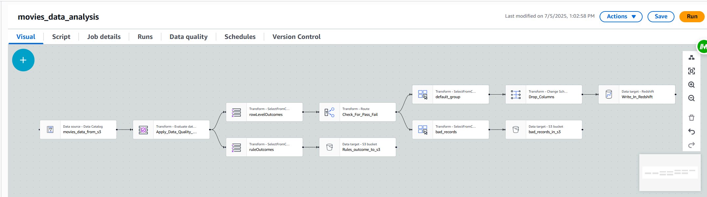

# Quality Movie Data Project

This project implements an automated AWS data pipeline to process, validate, and store movie data. The primary objective is to ingest raw movie data from an S3 bucket, enforce a set of data quality rules, and load only the high-quality, validated records into a Redshift data warehouse for analysis. This pipeline specifically filters for movies with a high IMDb rating (greater than 8.5).

***

## Project Architecture

The entire data flow is orchestrated using a serverless architecture on AWS, ensuring scalability and efficiency.

The key AWS services involved are:

* **Amazon S3:** Acts as the central data lake. It stores the initial raw movie data (`Raw_Movies_data`), the records that fail the quality checks, and the logs detailing the outcomes of the data quality rules.
* **AWS Glue Crawler:** Automatically discovers the schema of the raw data in S3 and populates the AWS Glue Data Catalog with this metadata.
* **AWS Glue Data Catalog:** Serves as a persistent metadata store for all data assets, making them discoverable and manageable for ETL jobs.
* **AWS Glue Job:** Executes the core serverless ETL logic. It reads data from the Glue Data Catalog, applies the data quality rules using the `EvaluateDataQuality` transform, segregates clean and rejected data, and loads the results to their respective destinations.
* **Amazon Redshift:** The scalable data warehouse where the final, clean, and high-quality movie data is stored for business intelligence and analytics.
* **Amazon Athena:** Can be used to directly query the curated data in Redshift or even the raw/rejected data in S3.
* **Amazon CloudWatch & EventBridge:** Monitor the Glue job's execution status and trigger automated event-driven workflows.
* **Amazon SNS:** Provides a notification system, configured to send email alerts about the success or failure of the data pipeline.

***

## Data Processing and Quality Rules

The heart of the pipeline is the `movies_data_analysis` AWS Glue job, which performs a series of transformations and validations.

The job's workflow is as follows:

1.  **Data Ingestion:** The process begins by reading the source movie dataset from the Glue Data Catalog.
2.  **Data Quality Evaluation:** Each record is rigorously checked against a predefined DQDL (Data Quality Definition Language) ruleset:
    * `RowCount > 0`: Ensures the source dataset is not empty.
    * `IsComplete "imdb_rating"`: Verifies that every record has a value in the `imdb_rating` column.
    * `ColumnValues "imdb_rating" between 8.5 and 10.3`: The core business rule, filtering for movies with a high rating.
3.  **Data Routing:** Based on the quality check outcomes, the job splits the data into three distinct outputs:
    * **Good Records:** Records that pass all rules are sent for further processing.
    * **Bad Records:** Records that fail any rule are isolated and stored in a designated S3 path (`s3://movies-data-gds-project/rule_failed_records/`) for analysis and reprocessing.
    * **Rule Outcomes:** A summary of the data quality check results is written to S3 (`s3://movies-data-gds-project/rules_outcome/`) for auditing and monitoring purposes.
4.  **Data Loading:**
    * The **good records** have unnecessary columns dropped and are then written to the final Amazon Redshift table (`dev_movies_imdb_movies_rating`).
    * The **bad records** and **rule outcomes** are saved as JSON files in S3.

***
